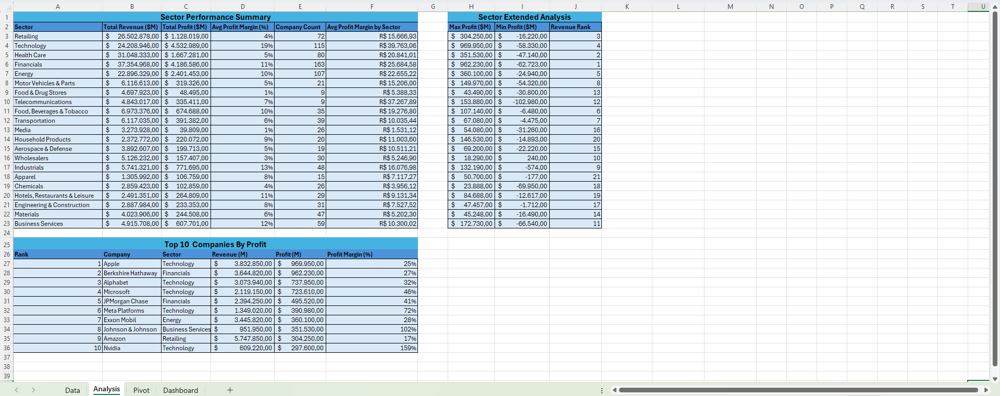
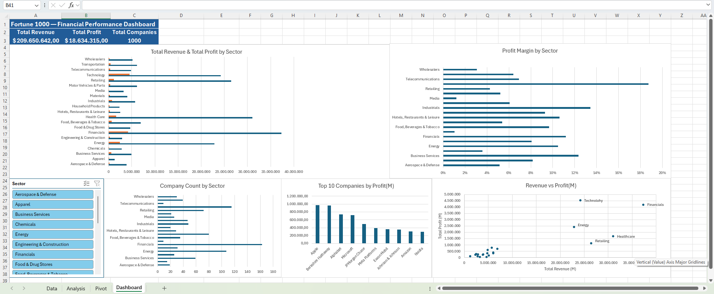

# Fortune 1000 Financial Performance Analysis (Excel)

## Project Overview
This project delivers a comprehensive financial analysis of the Fortune 1000 companies (2024) using Microsoft Excel. The goal was to identify which sectors and companies drive the most revenue and profit — and where efficiency breaks down despite high volume.

---

## Dataset
- **Source:** [2024 Fortune 1000 Companies – Kaggle](https://www.kaggle.com/datasets/jeannicolasduval/2024-fortune-1000-companies)
- **Scope:** 1,000 companies across 21 sectors, including revenue, profit, employees, market cap and ranking data.
- **Note on units:** Financial figures in the dataset represent values in hundreds of dollars. Divide by 10,000 to convert to billions. Example: Walmart appears as 5,747,850 = ~$574.7B in revenue, consistent with publicly reported 2024 figures. All insights below reflect corrected billion-dollar values.
- **Note:** The full dataset is located in the `/data` folder.

---

## Tools & Technologies
- Microsoft Excel
- Pivot Tables and PivotCharts
- Slicers (connected to multiple PivotTables)
- Excel Functions (SUMIF, COUNTIF, AVERAGEIF, MAXIFS, MINIFS, RANK, LARGE, INDEX+MATCH, IFERROR)
- Calculated Fields within PivotTables

---

## Workbook Structure

| Sheet | Purpose |
|---|---|
| Data | Raw dataset — 1,000 companies, 30+ columns |
| Analysis | Formula-based analysis with 2 structured tables |
| Pivot | PivotTables powering the interactive dashboard |
| Dashboard | Interactive dashboard with 6 charts and Slicer |

---

## Excel Functions Used

| Function | Application |
|---|---|
| SUMIF | Total revenue and profit aggregated by sector |
| COUNTIF | Company count per sector |
| AVERAGEIF | Average profit per company by sector |
| MAXIFS | Highest profit company within each sector |
| MINIFS | Lowest profit company within each sector |
| RANK | Dynamic revenue ranking across all sectors |
| LARGE | Top 10 companies by absolute profit |
| INDEX + MATCH | Company name and sector lookup by profit rank |
| IFERROR | Error handling for division operations |

---

## Data Modeling

- **3 independent PivotTables** on the Pivot sheet, each powering a separate chart
- **Calculated Field** for Profit Margin (Profits_M / Revenues_M) built directly inside the PivotTable
- **Slicer** connected to all 3 PivotTables — filtering all charts simultaneously by sector

---

## Business Questions

1. Which sectors generate the highest total revenue?
2. Which sectors deliver the best profit margin — and does high revenue guarantee high efficiency?
3. Who are the top 10 most profitable companies in the Fortune 1000?
4. Which sectors have the most companies, and how does size relate to performance?
5. What is the relationship between total revenue and total profit across sectors?

---

## Dashboard Preview

### Analysis Tab


### Dashboard Tab


---

## Key Insights

- **Financials dominates in total revenue** at ~$3.7T across 163 companies — the largest sector both in revenue and company count in the Fortune 1000.

- **Technology is the most efficient sector** with a 19% profit margin, despite ranking only 4th in total revenue. This proves that volume alone does not determine profitability.

- **Apple leads in absolute profit** at ~$97B, followed closely by Berkshire Hathaway at ~$96B — both significantly ahead of the rest of the top 10. Notably, 6 of the top 10 most profitable companies are in Technology.

- **Retailing generates high revenue (~$2.6T) but only 4% profit margin**, exposing a classic high-volume, low-efficiency business model. Food & Drug Stores is the worst performer at just 1% margin despite significant revenue.

- **The top 5 sectors by revenue** (Financials, Health Care, Retailing, Technology, Energy) show very different margin profiles — ranging from 4% to 19% — demonstrating that sector size and sector efficiency are largely independent.

- **Financials' revenue dominance is partly structural:** with 163 companies — 48 more than second-place Technology — its total revenue reflects quantity of companies as much as individual performance.

---

## Strategic Recommendations

- **Technology warrants investment focus:** highest margin sector with strong representation — quality over quantity.
- **Retailing and Food & Drug Stores need margin improvement:** high revenue but structurally low profitability suggests pricing or cost inefficiency.
- **Financials' dominance is partly a function of company count:** average per-company revenue is more moderate when adjusted for sector size.

---

## Contact
- LinkedIn: [Murilo Maffei Vitti](https://www.linkedin.com/in/murilomvitti/)
- Email: [murilo.mvitti@gmail.com](mailto:murilo.mvitti@gmail.com)
- GitHub: [MuriloVitti](https://github.com/MuriloVitti)
```
